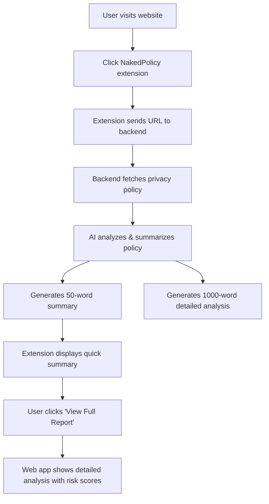

# 🔍 NakedPolicy

**Privacy Policies. Terms. Cookies. Simplified.**

NakedPolicy is an intelligent browser extension that breaks down complex legal documents — privacy policies, terms & conditions, cookie notices, and codes of conduct — into simple, human-friendly summaries.

Modern digital platforms bury users under pages of legal jargon. **NakedPolicy cuts through the noise and gives you instant clarity**, one line at a time.

[](https://github.com)
[](https://python.org)
[](https://reactjs.org)
[](LICENSE)

---

## 🚨 The Problem It Solves

Every day, millions of users blindly click "Accept" without understanding what they're agreeing to. Privacy policies and terms are intentionally:

- **Long** — Often 10,000+ words
- **Confusing** — Written in dense legal language
- **Packed with jargon** — Technical and legal terms everywhere

Because of this, users rarely know:

❌ What personal data is collected  
❌ How it's used or shared  
❌ How long it's stored  
❌ What rights they actually have  
❌ What cookies and trackers are running in the background  

**This lack of transparency puts people at risk** of unwanted tracking, data misuse, and unfair terms.

---

## � How NakedPolicy Helps

NakedPolicy brings **transparency to the digital world** with:

### ✅ One-Line Legal Summaries
Transforms lengthy, complex documents into **short, digestible insights** — section by section.

### 🔍 Clarity on Data Collection
Shows **exactly what data** is being collected, how it's used, and who it's shared with.

### 🍪 Simple Cookie Explanations
Explains tracking technologies in **plain language** — no tech background required.

### ⚡ Instant, Informed Consent
Helps users make **smart privacy decisions** before clicking "Accept".

---

## ✨ Core Features

- 🤖 **Real-time Policy Summarization** using AI (Google Gemini)
- 📊 **Section-wise Breakdown** for easier understanding
- 🍪 **Cookie and Tracker Detection**
- 🚨 **Risk Indicators** (e.g., high data sharing, third-party usage, profiling)
- 🎯 **Dual-Mode Summaries** — 50-word quick view + 1000-word detailed analysis
- 🌐 **Web Application** — Upload and analyze any policy document
- 🔌 **Chrome Extension** — Instant analysis on any website
- 🎨 **Clean, Distraction-Free UI**
- 🌍 **Cross-Browser Support** (Chrome, Firefox, Edge — planned)

---

## 🎯 How It Works



**Step-by-Step:**

1. **Install** the NakedPolicy extension
2. **Visit** any website with a privacy policy, terms page, or cookie banner
3. NakedPolicy **scans and extracts** key legal sections
4. AI **generates one-line summaries** and highlights critical points
5. Users get an **immediate, human-friendly overview**

---

## 🚀 Quick Start

### 1. Start Backend
```bash
start-backend.bat
```

### 2. Start Frontend
```bash
start-frontend.bat
```

### 3. Use the App
- **Web:** Visit `http://localhost:5173`
- **Extension:** Build with `npm run build`, load `dist/` in Chrome

---

## 🔧 Setup

### Prerequisites
- Python 3.8+
- Node.js 16+
- Chrome browser (for extension)

### Installation

1. **Clone repository**
   ```bash
   git clone https://github.com/Swinalwaghmare/NakedPolicy.git
   cd NakedPolicy
   ```

2. **Backend setup**
   ```bash
   pip install -r requirements.txt
   playwright install chromium
   ```

3. **Frontend setup**
   ```bash
   cd frontend
   npm install
   ```

4. **Extension setup**
   ```bash
   npm install
   npm run build
   ```

5. **API Key Setup**
   `.env` file setup
   
   ```
   # Database Type: 'json' or 'dynamodb'
   # - json: Local file storage (good for development, single server)
   # - dynamodb: AWS DynamoDB (good for production, multi-server, scalability)
   DB_TYPE=dynamodb

   # Cache Settings
   CACHE_ENABLED=true
   CACHE_EXPIRY_DAYS=30


   # DynamoDB Table Configuration
   DYNAMODB_TABLE_NAME=naked-policy-summaries
   DYNAMODB_REGION=us-east-1

   # AWS Credentials (or use IAM roles)
   AWS_ACCESS_KEY_ID=
   AWS_SECRET_ACCESS_KEY=

   # Perplexity API Key (for AI summarization)
   PERPLEXITY_API_KEY=

   # Flask Environment: development or production
   FLASK_ENV=development

   # Server Port
   PORT=5000
   ```
---

## 📖 Usage

### Web Application

1. Start backend: `start-backend.bat`
2. Start frontend: `start-frontend.bat`
3. Open `http://localhost:5173`
4. Upload a `.txt` policy file or enter a URL
5. View AI-generated summary with risk assessment

### Chrome Extension

1. Build: `npm run build`
2. Open `chrome://extensions/`
3. Enable "Developer mode"
4. Click "Load unpacked" → Select `dist/` folder
5. Visit any website → Click NakedPolicy icon
6. Click "Analyze Privacy Policy"
7. View instant summary or "View Full Report"

### API Endpoints

```bash
# Create demo summary (no API key needed)
POST /demo-summary
Content-Type: application/json
{
  "url": "github.com"
}

# Fetch and analyze (requires API key)
POST /fetch-and-summarize
Content-Type: application/json
{
  "url": "github.com"
}

# Get full summary by ID
GET /summary/<id>

# Health check
GET /health
```

---

## 📁 Project Structure

```
NakedPolicy/
├── app.py                    # Flask backend API
├── policy_fetcher_safe.py    # Policy extraction from websites
├── summary_store.py          # Summary storage system
├── requirements.txt          # Python dependencies
├── summaries_db.json         # Stored summaries database
│
├── frontend/                 # React web application
│   ├── src/
│   │   ├── App.jsx          # Main app with URL parameter support
│   │   └── components/      # React components
│   ├── package.json
│   └── vite.config.js
│
├── src/                      # Chrome extension
│   ├── App.tsx              # Extension popup
│   ├── components/          # Extension UI components
│   └── background.ts        # Background service worker
│
├── public/
│   └── manifest.json        # Extension manifest (Manifest V3)
│
├── start-backend.bat        # Windows backend startup script
└── start-frontend.bat       # Windows frontend startup script
```

---

## 🛠️ Tech Stack

**Backend:**
- Python 3.8+
- Flask & Flask-CORS
- Google Gemini AI (google-genai)
- Playwright (for web scraping)

**Frontend:**
- React 18
- Vite
- TailwindCSS
- Lucide Icons

**Extension:**
- TypeScript
- React
- Chrome Extension Manifest V3

**Database:**
- JSON file storage (summaries_db.json)
- Planned: MongoDB / PostgreSQL

**Deployment:**
- Planned: Vultr (Coolify)

---

## 📝 Example Output

**Input:** Privacy policy from github.com

**50-word Summary (Extension):**
```
🚫 GitHub collects extensive personal data including browsing history and location.
⚠️ Data shared with third-party advertisers.
⚠️ Limited user control over data deletion.
⚠️ Indefinite data retention period.
```

**1000-word Summary (Frontend):**

### 🚫 CRITICAL ISSUES
- Data selling to third parties
- Indefinite storage periods
- Extensive tracking across devices

### ⚠️ CONCERNING PRACTICES
- Third-party sharing without explicit consent
- Location tracking enabled by default
- Limited opt-out options

### ✅ GOOD THINGS
- Uses encryption for data transmission
- Provides data access rights
- GDPR compliant

### ℹ️ STANDARD STUFF
- Age requirements (13+)
- Cookie usage for functionality
- Terms update notifications

---

## 🗺️ Roadmap

- [ ] **Multi-Language Support** — Analyze policies in Spanish, French, German, etc.
- [ ] **Risk Scoring** — Automated risk scores (1-10) for policies
- [ ] **Machine Learning Tracker Classification** — Identify tracking technologies automatically
- [ ] **Policy Comparison View** — Compare Website A vs. Website B side-by-side
- [ ] **Mobile App Version** — iOS & Android apps
- [ ] **Enterprise API** — Developer-grade API for integration
- [ ] **Firefox & Edge Extensions** — Cross-browser support
- [ ] **Dark Mode** — User preference support
- [ ] **Export Reports** — PDF/CSV format
- [ ] **Historical Tracking** — Monitor policy changes over time

---

## 🎯 Why It Matters

NakedPolicy **empowers people** to:

✅ **Protect their privacy**  
✅ **Avoid hidden data traps**  
✅ **Understand their digital rights**  
✅ **Make confident consent decisions**  

**Browse the internet in control, not in the dark.**

---

## 🐛 Troubleshooting

### Backend won't start
```bash
pip install --upgrade google-genai flask flask-cors playwright
playwright install chromium
```

### Frontend won't start
```bash
cd frontend
rm -rf node_modules package-lock.json
npm install
npm run dev
```

### Extension not working
- Verify backend is running on port 5000
- Check `chrome://extensions/` for errors
- Rebuild: `npm run build`
- Reload extension in Chrome

### API Quota Error
- Use `/demo-summary` endpoint instead
- Wait 1-2 minutes for quota reset
- Check usage: https://aistudio.google.com/usage

### CORS Issues
- Ensure Flask-CORS is installed
- Check backend logs for CORS errors
- Verify extension has correct API URL

---

## 🤝 Contributing

Contributions are **welcome**! If you have ideas, improvements, or feature suggestions:

1. **Fork** the repo
2. **Create** a new branch (`feature/amazing-feature`)
3. **Commit** your changes (`git commit -m 'Add amazing feature'`)
4. **Push** to the branch (`git push origin feature/amazing-feature`)
5. **Submit** a pull request

---

## 📄 License

**MIT License** — Free to use, modify, and distribute.

See [LICENSE](LICENSE) for more information.


---

**Made with ❤️ and AI by the NakedPolicy Team**

Karan Tomar (Team Leader)                                             
Swinal Waghmare (Member)                                         
Harshal Pantawane (Member)                                 
Anirudh Trivedi (Member)                              

*Bringing transparency to the digital world, one policy at a time.*

